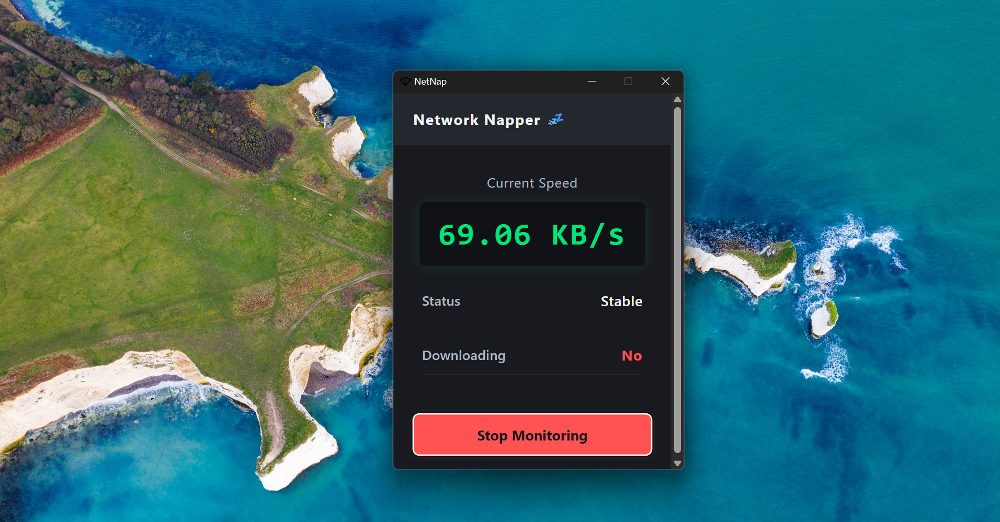
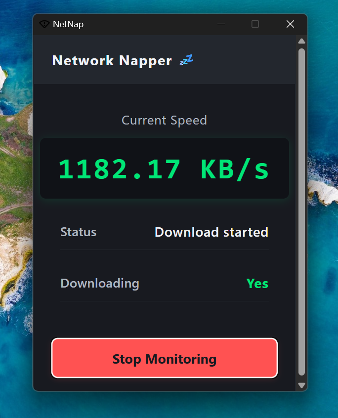
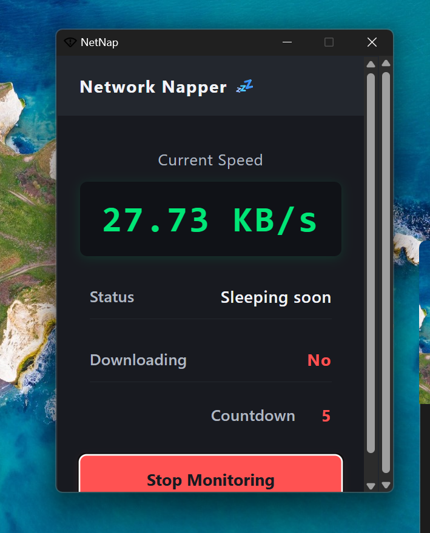

# NetNap

NetNap is a cross-platform desktop utility that automatically puts your device to sleep after your downloads finish. Built with [Tauri](https://tauri.app/) and a modern, minimal UI, NetNap monitors your network speed and triggers sleep mode when downloads are complete.

## Features

- **Network Monitoring:** Continuously tracks your current download speed.
- **Auto Sleep:** Automatically puts your device to sleep after downloads finish and a short countdown.
- **Simple UI:** Clean, desktop-style interface with real-time speed and status display.
- **Manual Control:** Start or stop monitoring at any time.

## How It Works

NetNap continuously monitors your network speed in the background. When it detects that downloads have stopped (i.e., network speed drops below a threshold for a period), It automatically puts your device to sleep. You can manually start or stop the monitoring at any time using the app's control button.

_The network speed monitoring logic is implemented in Rust, adapted from the [net-speed-monitor](https://github.com/nof1eld/net-speed-monitor) project._

## Screenshots







## Getting Started

### Prerequisites

- [Node.js](https://nodejs.org/) (v16+ recommended)
- [Rust](https://www.rust-lang.org/tools/install)
- [Tauri CLI](https://tauri.app/v2/guides/getting-started/prerequisites/)

### Install Dependencies

```bash
# Install frontend dependencies
cd frontend
npm install

# Install Tauri CLI globally if you haven't
npm install -g @tauri-apps/cli
```

### Run in Development

```bash
# In the frontend directory, start the dev server
npm run dev

# In another terminal, at the project root, run the Tauri app
npm run tauri dev
```

### Build for Production

```bash
# Build the frontend
cd frontend
npm run build

# Build the Tauri app (from project root)
npm run tauri build
```

## Usage

- Launch NetNap, the app will monitor your network speed.
- Start your download.
- When download stops, a countdown will appear to put the device to sleep.
- Use the "Stop Monitoring" button to pause monitoring at any time.

## Project Structure

```
NetNap/
├── frontend/         # Frontend source (HTML, CSS, JS)
│   ├── src/
│   ├── public/
│   └── ...
├── src-tauri/        # Tauri backend (Rust)
│   ├── src/
│   ├── icons/
│   └── ...
├── package.json      # Project scripts and dependencies
└── README.md         # This file
```

## Contributing

Pull requests are welcome! For major changes, please open an issue first to discuss what you would like to change.

## License

_(Add your license here, e.g., MIT, Apache-2.0, etc.)_
